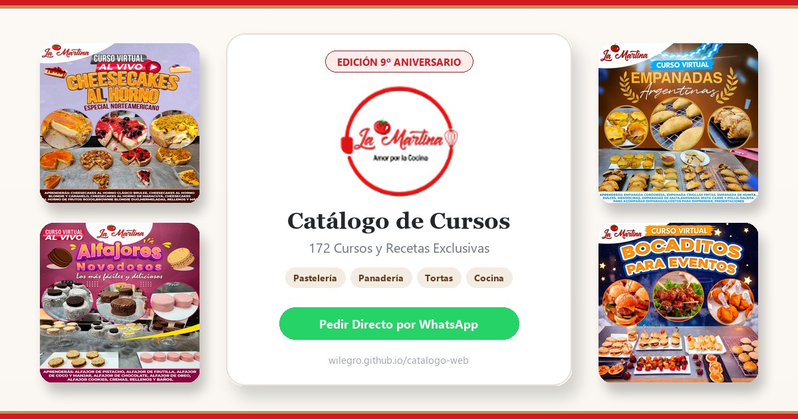

  

    

  # 🍰 Catálogo Oficial • 9º Aniversario
  ### *La Martina — Amor por la Cocina*

  
  
  

  

    <strong>Una recopilación maestra de recetas probadas, técnicas artesanales y secretos gastronómicos creados para inspirar, deleitar y emprender con éxito.</strong>
  

---

## 🌟 Celebrando 9 Años de Tradición y Pasión Culinaria

Con motivo de nuestro **9º Aniversario**, en **La Martina** reunimos la biblioteca gastronómica más completa y detallada de nuestra historia: **172 cursos virtuales** pensados tanto para quienes desean emprender su propio negocio dulce o salado, como para los amantes de la buena mesa en familia.

Cada curso incluye recetarios exactos, listas de insumos, técnicas de preparación paso a paso, secretos de conservación y presentaciones comerciales de alto impacto.

---

## 🧁 Colecciones del Catálogo

El catálogo reúne 5 mundos gastronómicos cuidadosamente seleccionados:

| Especialidad | Cursos | Descripción |
| :--- | :---: | :--- |
| **🍰 Pastelería Fina & Novedades** | **62 Cursos** | Alfajores gourmet, bolos de pote, brazos gitanos, donas, postres en vasito, galletas temáticas y bocaditos dulces. |
| **🥗 Repostería & Cocina Saludable** | **32 Cursos** | Recetas sin azúcar añadida, harinas alternativas, opciones keto, veganas, postres funcionales y nutritivos. |
| **🍳 Comida & Gastronomía Internacional** | **28 Cursos** | Clásicos de la comida criolla, peruana, brasileña, pastas artesanales, comida rápida comercial, carnes y asados. |
| **🎂 Tortas de Fiesta & Cheesecakes** | **27 Cursos** | Cheesecakes horneados y fríos, tortas altas, bizcochos húmedos, decoraciones en tendencia y rellenos de autor. |
| **🥖 Panadería Tradicional & Bocaditos** | **23 Cursos** | Panes comerciales y rústicos, masas dulces, empanadas argentinas y fritas, masas para eventos y bocaditos salados. |

---

## ✨ Lo que hace único a este Catálogo

* 📖 **Recetarios 100% probados:** Proporciones exactas para garantizar resultados perfectos desde la primera preparación.
* 💡 **Enfoque Emprendedor:** Diseñados para calcular costos, estandarizar producción y maximizar la rentabilidad de cada receta.
* 📱 **Experiencia Interactiva:** Una plataforma web ligera, rápida y moderna donde puedes explorar por categoría, buscar por nombre, seleccionar tus cursos favoritos en tu carrito y generar tu orden directa con un solo clic.
* 🤝 **Atención Personalizada:** Cada solicitud se procesa de forma directa por WhatsApp para brindarte asesoría inmediata en tus inscripciones y materiales.

---

## 🌐 Explora la Colección Completa

Accede al catálogo interactivo y elige tus próximas especialidades:

👉 **[https://wilegro.github.io/catalogo-web](https://wilegro.github.io/catalogo-web/)**

---

  © 2026 <strong>La Martina</strong> • Amor por la Cocina • Catálogo Oficial 9º Aniversario. Todos los derechos reservados.

